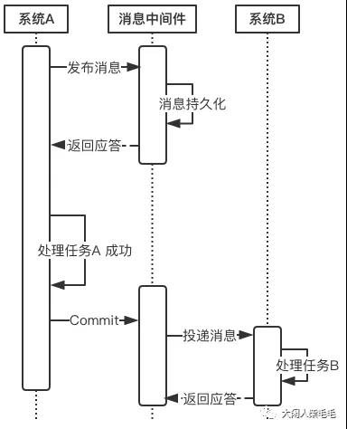
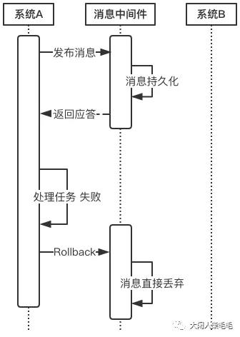
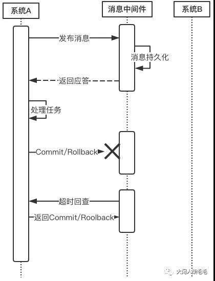
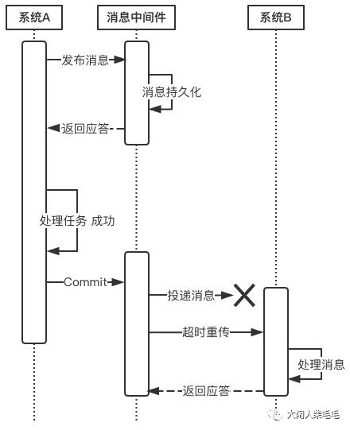
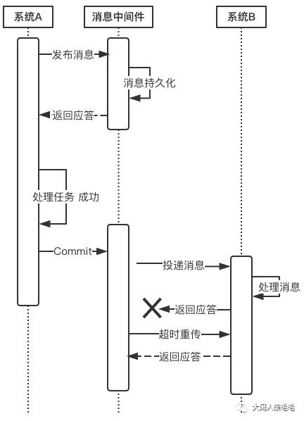
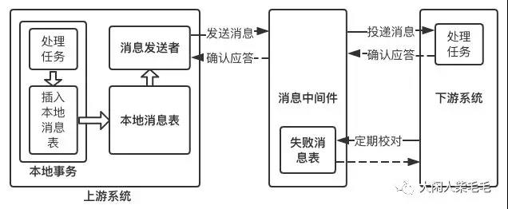
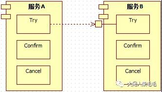

分布式事务的解决方案有如下几种：

- 全局消息
- 基于可靠消息服务的分布式事务
- TCC
- 最大努力通知

# 方案1：全局事务（DTP模型）

全局事务基于DTP模型实现。DTP是由X/Open组织提出的一种分布式事务模型——X/Open Distributed Transaction Processing Reference Model。它规定了要实现分布式事务，需要三种角色：

- AP：Application 应用系统

它就是我们开发的业务系统，在我们开发的过程中，可以使用资源管理器提供的事务接口来实现分布式事务。
- TM：Transaction Manager 事务管理器
    - 分布式事务的实现由事务管理器来完成，它会提供分布式事务的操作接口供我们的业务系统调用。这些接口称为TX接口。
    - 事务管理器还管理着所有的资源管理器，通过它们提供的XA接口来同一调度这些资源管理器，以实现分布式事务。
    - DTP只是一套实现分布式事务的规范，并没有定义具体如何实现分布式事务，TM可以采用2PC、3PC、Paxos等协议实现分布式事务。
- RM：Resource Manager 资源管理器
    - 能够提供数据服务的对象都可以是资源管理器，比如：数据库、消息中间件、缓存等。大部分场景下，数据库即为分布式事务中的资源管理器。
    - 资源管理器能够提供单数据库的事务能力，它们通过XA接口，将本数据库的提交、回滚等能力提供给事务管理器调用，以帮助事务管理器实现分布式的事务管理。
    - XA是DTP模型定义的接口，用于向事务管理器提供该资源管理器(该数据库)的提交、回滚等能力。
    - DTP只是一套实现分布式事务的规范，RM具体的实现是由数据库厂商来完成的。
    
> 1. 有没有基于DTP模型的分布式事务中间件？
> 2. DTP模型有啥优缺点？

# 方案2：基于可靠消息服务的分布式事务

这种实现分布式事务的方式**需要通过消息中间件来实现**。假设有A和B两个系统，分别可以处理任务A和任务B。
此时系统A中存在一个业务流程，需要将任务A和任务B在同一个事务中处理。
下面来介绍基于消息中间件来实现这种分布式事务。

1. 在系统A处理任务A前，首先向消息中间件发送一条消息
1. 消息中间件收到后将该条消息持久化，但并不投递。此时下游系统B仍然不知道该条消息的存在。
1. 消息中间件持久化成功后，便向系统A返回一个确认应答；
1. 系统A收到确认应答后，则可以开始处理任务A；
1. 任务A处理完成后，向消息中间件发送Commit请求。该请求发送完成后，对系统A而言，该事务的处理过程就结束了，此时它可以处理别的任务了。
1. 但commit消息可能会在传输途中丢失，从而消息中间件并不会向系统B投递这条消息，从而系统就会出现不一致性。这个问题由消息中间件的事务回查机制完成，下文会介绍。
1. 消息中间件收到Commit指令后，便向系统B投递该消息，从而触发任务B的执行；
1. 当任务B执行完成后，系统B向消息中间件返回一个确认应答，告诉消息中间件该消息已经成功消费，此时，这个分布式事务完成。

> 上述过程可以得出如下几个结论：
> 1. 消息中间件扮演者分布式事务协调者的角色。
> 2. 系统A完成任务A后，到任务B执行完成之间，会存在一定的时间差。在这个时间差内，整个系统处于数据不一致的状态，但这短暂的不一致性是可以接受的，因为经过短暂的时间后，系统又可以保持数据一致性，满足BASE理论。

上述过程中，如果任务A处理失败，那么需要进入回滚流程，如下图所示：

1. 若系统A在处理任务A时失败，那么就会向消息中间件发送Rollback请求。和发送Commit请求一样，系统A发完之后便可以认为回滚已经完成，它便可以去做其他的事情。
1. 消息中间件收到回滚请求后，直接将该消息丢弃，而不投递给系统B，从而不会触发系统B的任务B

> 此时系统又处于一致性状态，因为任务A和任务B都没有执行。

上面所介绍的Commit和Rollback都属于理想情况，但在实际系统中，Commit和Rollback指令都有可能在传输途中丢失。
那么当出现这种情况的时候，消息中间件是如何保证数据一致性呢？
——答案就是超时询问机制。

系统A除了实现正常的业务流程外，还需提供一个事务询问的接口，供消息中间件调用。
当消息中间件收到一条事务型消息后便开始计时，如果到了超时时间也没收到系统A发来的Commit或Rollback指令的话，就会主动调用系统A提供的事务询问接口询问该系统目前的状态。
该接口会返回三种结果：

- 提交

若获得的状态是“提交”，则将该消息投递给系统B。

- 回滚

若获得的状态是“回滚”，则直接将条消息丢弃。

- 处理中

若获得的状态是“处理中”，则继续等待。

> 消息中间件的超时询问机制能够防止上游系统因在传输过程中丢失Commit/Rollback指令而导致的系统不一致情况，
> 而且能降低上游系统的阻塞时间，上游系统只要发出Commit/Rollback指令后便可以处理其他任务，无需等待确认应答。
> 而Commit/Rollback指令丢失的情况通过超时询问机制来弥补，这样大大降低上游系统的阻塞时间，提升系统的并发度。

下面来说一说**消息投递过程的可靠性保证**。

当上游系统执行完任务并向消息中间件提交了Commit指令后，便可以处理其他任务了，此时它可以认为事务已经完成，
接下来消息中间件一定会保证消息被下游系统成功消费掉！那么这是怎么做到的呢？
这由消息中间件的投递流程来保证。

消息中间件向下游系统投递完消息后便进入阻塞等待状态，下游系统便立即进行任务的处理，任务处理完成后便向消息中间件返回应答。
消息中间件收到确认应答后便认为该事务处理完毕！

如果消息在投递过程中丢失，或消息的确认应答在返回途中丢失，那么消息中间件在等待确认应答超时之后就会重新投递，直到下游消费者返回消费成功响应为止。
当然，一般消息中间件可以设置消息重试的次数和时间间隔，比如：当第一次投递失败后，每隔五分钟重试一次，一共重试3次。
如果重试3次之后仍然投递失败，那么这条消息就需要人工干预。

> 有的同学可能要问：消息投递失败后为什么不回滚消息，而是不断尝试重新投递？

这就涉及到整套分布式事务系统的实现成本问题。
我们知道，当系统A将向消息中间件发送Commit指令后，它便去做别的事情了。
如果此时消息投递失败，需要回滚的话，就需要让系统A事先提供回滚接口，这无疑增加了额外的开发成本，业务系统的复杂度也将提高。
对于一个业务系统的设计目标是，在保证性能的前提下，最大限度地降低系统复杂度，从而能够降低系统的运维成本。

> 不知大家是否发现，上游系统A向消息中间件提交Commit/Rollback消息采用的是异步方式，也就是当上游系统提交完消息后便可以去做别的事情，
> 接下来提交、回滚就完全交给消息中间件来完成，并且完全信任消息中间件，认为它一定能正确地完成事务的提交或回滚。
> 然而，消息中间件向下游系统投递消息的过程是同步的。也就是消息中间件将消息投递给下游系统后，它会阻塞等待，等下游系统成功处理完任务返回确认应答后才取消阻塞等待。
> 为什么这两者在设计上是不一致的呢？

首先，上游系统和消息中间件之间**采用异步通信是为了提高系统并发度**。
业务系统直接和用户打交道，用户体验尤为重要，因此这种异步通信方式能够极大程度地降低用户等待时间。
此外，异步通信相对于同步通信而言，没有了长时间的阻塞等待，因此系统的并发性也大大增加。
但异步通信可能会引起Commit/Rollback指令丢失的问题，这就由消息中间件的超时询问机制来弥补。

> 那么，消息中间件和下游系统之间为什么要采用同步通信呢？

异步能提升系统性能，但随之会增加系统复杂度；而同步虽然降低系统并发度，但实现成本较低。
因此，在对并发度要求不是很高的情况下，或者服务器资源较为充裕的情况下，我们可以选择同步来降低系统的复杂度。

我们知道，消息中间件是一个独立于业务系统的第三方中间件，它不和任何业务系统产生直接的耦合，
它也不和用户产生直接的关联，它一般部署在独立的服务器集群上，具有良好的可扩展性，所以不必太过于担心它的性能，
如果处理速度无法满足我们的要求，可以**增加机器**来解决。
而且，即使消息中间件处理速度有一定的延迟那也是可以接受的，因为前面所介绍的**BASE理论**就告诉我们了，我们追求的是最终一致性，而非实时一致性，
因此消息中间件产生的时延导致事务短暂的不一致是可以接受的。

# 方案3：最大努力通知（定期校对）

最大努力通知也被称为定期校对，其实在方案二中已经包含，这里再单独介绍，主要是为了知识体系的完整性。
这种方案也需要消息中间件的参与，其过程如下：

- 上游系统在完成任务后，向消息中间件同步地发送一条消息，确保消息中间件成功持久化这条消息，然后上游系统可以去做别的事情了；
- 消息中间件收到消息后负责将该消息同步投递给相应的下游系统，并触发下游系统的任务执行；
- 当下游系统处理成功后，向消息中间件反馈确认应答，消息中间件便可以将该条消息删除，从而该事务完成。

上面是一个理想化的过程，但在实际场景中，往往会出现如下几种意外情况：

- 消息中间件向下游系统投递消息失败
- 上游系统向消息中间件发送消息失败

对于第一种情况，消息中间件具有**重试机制**，我们可以在消息中间件中设置消息的重试次数和重试时间间隔，
对于网络不稳定导致的消息投递失败的情况，往往重试几次后消息便可以成功投递，如果超过了重试的上限仍然投递失败，
那么消息中间件不再投递该消息，而是记录在失败消息表中，消息中间件需要提供失败消息的查询接口，下游系统会定期查询失败消息，
并将其消费，这就是所谓的`定期校对`。

如果重复投递和定期校对都不能解决问题，往往是因为下游系统出现了严重的错误，此时就需要人工干预。

对于第二种情况，需要在上游系统中建立消息重发机制。可以在上游系统建立一张`本地消息表`，并将 `任务处理过程` 和 `向本地消息表中插入消息` 这两个步骤放在一个本地事务中完成。
如果向本地消息表插入消息失败，那么就会触发回滚，之前的任务处理结果就会被取消。
如果这两步都执行成功，那么该本地事务就完成了。接下来会有一个专门的消息发送者不断地发送本地消息表中的消息，
如果发送失败它会返回重试。当然，也要给消息发送者设置重试的上限，一般而言，达到重试上限仍然发送失败，
那就意味着消息中间件出现严重的问题，此时也只有人工干预才能解决问题。

对于不支持事务型消息的消息中间件，如果要实现分布式事务的话，就可以采用这种方式。
它能够通过`重试机制`+`定期校对`实现分布式事务，但相比于第二种方案，它达到数据一致性的周期较长，
而且还需要在上游系统中实现消息重试发布机制，以确保消息成功发布给消息中间件，这无疑增加了业务系统的开发成本，
使得业务系统不够纯粹，并且这些额外的业务逻辑无疑会占用业务系统的硬件资源，从而影响性能。

因此，尽量选择支持事务型消息的消息中间件来实现分布式事务，如RocketMQ。

# 方案4：TCC（两阶段型、补偿型）

TCC即为Try Confirm Cancel，它属于补偿型分布式事务。顾名思义，TCC实现分布式事务一共有三个步骤：

- Try：尝试待执行的业务

这个过程并未执行业务，只是完成所有业务的一致性检查，并预留好执行所需的全部资源
- Confirm：执行业务

这个过程真正开始执行业务，由于Try阶段已经完成了一致性检查，因此本过程直接执行，而不做任何检查。并且在执行的过程中，会使用到Try阶段预留的业务资源。
- Cancel：取消执行的业务

若业务执行失败，则进入Cancel阶段，它会释放所有占用的业务资源，并回滚Confirm阶段执行的操作。

下面以一个转账的例子来解释下TCC实现分布式事务的过程。

> 假设用户A用他的账户余额给用户B发一个100元的红包，并且余额系统和红包系统是两个独立的系统。

- Try
    - 创建一条转账流水，并将流水的状态设为交易中
    - 将用户A的账户中扣除100元（预留业务资源）
    - Try成功之后，便进入Confirm阶段
    - Try过程发生任何异常，均进入Cancel阶段

- Confirm
    - 向B用户的红包账户中增加100元
    - 将流水的状态设为交易已完成
    - Confirm过程发生任何异常，均进入Cancel阶段
    - Confirm过程执行成功，则该事务结束
    
- Cancel
    - 将用户A的账户增加100元
    - 将流水的状态设为交易失败

在传统事务机制中，业务逻辑的执行和事务的处理，是在不同的阶段由不同的部件来完成的：
业务逻辑部分访问资源实现数据存储，其处理是由业务系统负责；
事务处理部分通过协调资源管理器以实现事务管理，其处理由事务管理器来负责。
二者没有太多交互的地方，所以，传统事务管理器的事务处理逻辑，仅需要着眼于事务完成（commit/rollback）阶段，而不必关注业务执行阶段。

## TCC全局事务必须基于RM本地事务来实现全局事务

TCC服务是由Try/Confirm/Cancel业务构成的，
其Try/Confirm/Cancel业务在执行时，会访问资源管理器（Resource Manager，下文简称RM）来存取数据。
这些存取操作，必须要参与RM本地事务，以使其更改的数据要么都commit，要么都rollback。

这一点不难理解，考虑一下如下场景：

假设图中的服务B没有基于RM本地事务（以RDBS为例，可通过设置auto-commit为true来模拟），那么一旦[B:Try]操作中途执行失败，
TCC事务框架后续决定回滚全局事务时，该[B:Cancel]则需要判断[B:Try]中哪些操作已经写到DB、哪些操作还没有写到DB：假设[B:Try]业务有5个写库操作，
[B:Cancel]业务则需要逐个判断这5个操作是否生效，并将生效的操作执行反向操作。

不幸的是，由于[B:Cancel]业务也有n（0<=n<=5）个反向的写库操作，此时一旦[B:Cancel]也中途出错，
则后续的[B:Cancel]执行任务更加繁重。因为，相比第一次[B:Cancel]操作，后续的[B:Cancel]操作还需要判断先前的[B:Cancel]操作的n（0<=n<=5）个写库中哪几个已经执行、哪几个还没有执行，
这就涉及到了幂等性问题。而对幂等性的保障，又很可能还需要涉及额外的写库操作，该写库操作又会因为没有RM本地事务的支持而存在类似问题。。。
可想而知，如果不基于RM本地事务，TCC事务框架是无法有效的管理TCC全局事务的。

反之，基于RM本地事务的TCC事务，这种情况则会很容易处理：[B:Try]操作中途执行失败，TCC事务框架将其参与RM本地事务直接rollback即可。
后续TCC事务框架决定回滚全局事务时，在知道“[B:Try]操作涉及的RM本地事务已经rollback”的情况下，根本无需执行[B:Cancel]操作。

换句话说，基于RM本地事务实现TCC事务框架时，一个TCC型服务的cancel业务要么执行，要么不执行，不需要考虑部分执行的情况。

## TCC事务框架应该提供Confirm/Cancel服务的幂等性保障

一般认为，服务的幂等性，是指针对同一个服务的多次(n>1)请求和对它的单次(n=1)请求，二者具有相同的副作用。

在TCC事务模型中，Confirm/Cancel业务可能会被重复调用，其原因很多。比如，全局事务在提交/回滚时会调用各TCC服务的Confirm/Cancel业务逻辑。
执行这些Confirm/Cancel业务时，可能会出现如网络中断的故障而使得全局事务不能完成。
因此，故障恢复机制后续仍然会重新提交/回滚这些未完成的全局事务，这样就会再次调用参与该全局事务的各TCC服务的Confirm/Cancel业务逻辑。

既然Confirm/Cancel业务可能会被多次调用，就需要保障其幂等性。
那么，应该由TCC事务框架来提供幂等性保障？还是应该由业务系统自行来保障幂等性呢？
个人认为，应该是由TCC事务框架来提供幂等性保障。如果仅仅只是极个别服务存在这个问题的话，那么由业务系统来负责也是可以的；
然而，这是一类公共问题，毫无疑问，所有TCC服务的Confirm/Cancel业务存在幂等性问题。TCC服务的公共问题应该由TCC事务框架来解决；
而且，考虑一下由业务系统来负责幂等性需要考虑的问题，就会发现，这无疑增大了业务系统的复杂度。

